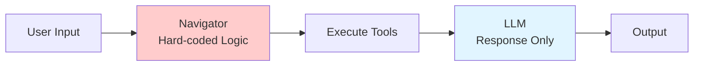
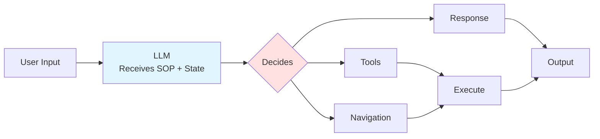
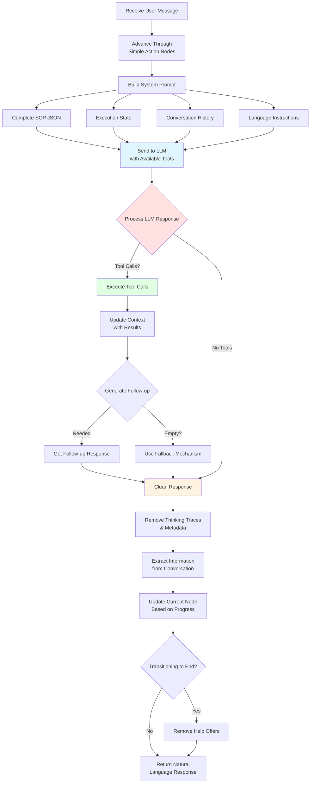

# LLM-Driven SOP Engine Architecture

## Overview

This document describes the refactored architecture of the SOP Engine, which demonstrates how modern LLMs (Claude Sonnet 4.5) can execute complex workflows autonomously without traditional orchestration frameworks.

## Architectural Philosophy

**Key Principle**: The LLM is the workflow engine.

Instead of programmatically navigating through workflow nodes, we pass the complete SOP definition and execution state to the LLM on every interaction. The LLM then:

- Interprets the SOP structure
- Decides which tools to call
- Determines navigation paths
- Maintains natural conversation flow

## Architecture Comparison

### Traditional Approach (Code-Driven)



- Hard-coded decision logic
- Fixed navigation rules
- LLM only for text generation
- Requires complex orchestration frameworks

### LLM-Driven Approach (This POC)



- LLM interprets SOP structure
- Dynamic decision making
- No hardcoded workflow logic
- Simple agent architecture

## System Components

### 1. SOPAgent (Main Orchestrator)

**Responsibility**: Manages the conversation loop and coordinates between LLM and tools.

**Key Methods**:

- `processMessage(userMessage)`: Main entry point
- `buildSystemPrompt()`: Constructs optimized context for LLM (token-efficient)
- `getRelevantNodes()`: Returns only current and next nodes (45% node reduction)
- `getRelevantContext()`: Filters context to only referenced keys
- `extractContextKeys()`: Extracts context keys from node definitions
- `executeTool(toolName, params)`: Executes MCP tools
- `extractContextFromMessages()`: Updates state from conversation
- `cleanResponse(rawResponse)`: Removes LLM thinking traces and metadata
- `advanceThroughSimpleNodes()`: Auto-navigates through simple action nodes
- `updateCurrentNode(assistantMessage)`: Manages workflow navigation
- `reconnectFlow()`: Handles empty responses after tool execution
- `generateFallbackResponse()`: Creates fallback when no response received
- `isTransitioningToEnd()`: Detects when approaching end nodes
- `removeHelpOffers()`: Removes "anything else" questions before ending

**Flow**:



### 2. ExecutionStateManager

**Responsibility**: Tracks workflow state throughout the conversation.

**State Properties**:

```typescript
{
  currentNodeId: string;          // Current position in SOP
  visitedNodes: string[];         // Navigation history
  context: Record<string, any>;   // Extracted data
  conversationHistory: Message[]; // Full conversation
  status: 'in_progress' | 'completed' | 'error';
}
```

**Key Features**:

- Context value storage and retrieval
- Placeholder replacement in templates
- Condition evaluation
- Conversation history tracking

### 3. SOP Definition

**Structure**: JSON-based decision tree

```typescript
interface SOP {
  name: string
  description: string
  version: string
  startNode: string
  nodes: Record<string, SOPNode>
}

interface SOPNode {
  id: string
  type: 'action' | 'decision' | 'end'
  description: string
  tool?: string
  toolParams?: Record<string, string>
  messageTemplate?: string
  nextNodes?: string[]
  condition?: string
}
```

**Node Types**:

- **action**: Perform an action (call tool, send message)
- **decision**: Evaluate a condition and branch
- **end**: Terminal node, workflow complete

### 4. MCP Server

**Purpose**: Provides tools for the LLM to execute.

**Tools for Customer Support SOP**:

- `getOrderStatus(orderId)`: Retrieves order information
- `cancelOrder(orderId, reason)`: Cancels an order
- `refundOrder(orderId, amount)`: Processes refund

**Integration**: Uses Model Context Protocol standard for tool exposure.

## System Prompt Structure (Token-Optimized)

**Optimization**: Instead of sending the entire SOP definition, we send only the current and next nodes, achieving **significant token reduction** while maintaining full functionality.

On every user interaction, the LLM receives:

```
You are a customer support AI agent following a Standard Operating Procedure (SOP).

# YOUR ROLE
You must follow the SOP workflow precisely while maintaining natural conversation with the customer.

# SOP CONTEXT
SOP Name: ${this.sop.name}
SOP Description: ${this.sop.description}

# CURRENT NODE
${JSON.stringify(current, null, 2)}

# NEXT POSSIBLE NODES
${JSON.stringify(next, null, 2)}

# REACHABLE NODES (for decision context)
${JSON.stringify(reachableNodes, null, 2)}

# CURRENT EXECUTION STATE
- Current Node: ${state.currentNodeId}
- Node Type: ${current.type}
- Node Description: ${current.description}
- Next Node(s): ${nextNodeInfo}
- Visited Nodes: ${JSON.stringify(state.visitedNodes)}
- Status: ${state.status}

# CURRENT CONTEXT
${JSON.stringify(relevantContext, null, 2)}

# CONVERSATION HISTORY
${state.conversationHistory.map((msg) => `${msg.role}: ${msg.content}`).join('\n')}

# INSTRUCTIONS

1. **Language Support**:
   - ALWAYS respond in the same language the user is using
   - Detect the user's language from their messages
   - Maintain consistency - if the user speaks Spanish, respond in Spanish; if German, respond in German, etc.
   - Support ALL languages naturally

2. **CRITICAL: Follow the SOP Flow**: You are currently at node "${state.currentNodeId}". Based on the node type and the SOP definition, determine what action to take next and guide the user accordingly.

3. **Node Types**:
   - **action**: Perform the described action. If a tool is specified, use it. If a messageTemplate exists, respond to the user with that message (with placeholders replaced from context).
   - **decision**: Evaluate the condition based on the current context. Decide which path to take.
   - **end**: The workflow is complete. Provide the final message.

4. **Tool Execution**: When a node specifies a tool, you MUST call that tool with the appropriate parameters. Extract parameters from the context using the toolParams mapping.

5. **Context Management**:
   - Extract information from user messages (e.g., order IDs, decisions)
   - Store tool results in context for use in subsequent nodes
   - Use context values to replace placeholders in message templates

6. **Navigation**:
   - After completing an action node, determine the next node from nextNodes
   - For decision nodes, evaluate the condition and choose the appropriate next node
   - Update your understanding of the current node as you progress
   - **CRITICAL**: If the current node's next node is an "end" type node, you MUST automatically transition to it WITHOUT asking if the user needs more help

7. **End Node Handling**:
   - When the next node after the current action is an "end" type node, DO NOT ask "Is there anything else I can help you with?"
   - Instead, provide your response and then immediately transition to the end node
   - Remove any "can I help you with anything else?" type questions from your response when approaching an end node
   - The conversation should conclude naturally without prompting for additional interactions

8. **Natural Conversation**: While following the SOP strictly, maintain a natural, helpful tone in the user's language.

9. **Response Format**: Your response should:
   - Address the user naturally in their language
   - Call tools when required by the current node
   - Extract any needed information from the user's message into context
   - If moving to an end node next, conclude the conversation gracefully without offering additional help
   - **CRITICAL**: NEVER include thinking, internal processing, workflow navigation, or meta-commentary in your response
   - Respond ONLY with the customer-facing message - no explanations of what you're doing internally
   - Do NOT use phrases like "Thinking:", "<thinking>", "Based on the SOP workflow", "Moving to node", etc.
   - Your response should be clean, natural conversation ONLY

# AVAILABLE TOOLS
${Array.from(this.availableTools.values())
  .map((tool) => `- ${tool.name}: ${tool.description}`)
  .join('\n')}

Now, process the user's message according to the SOP workflow.`
```

## Key Benefits

### 1. No Hardcoded Logic

- All navigation decisions made by LLM
- No if/else chains for workflow logic
- Flexible adaptation to edge cases

### 2. Simplified Codebase

- No complex orchestration framework
- Native LLM tools support via MCP Server

### 3. Natural Conversation

- LLM understands context naturally
- Can handle variations in user input
- Generates human-like responses
- **Multi-language support** - responds in user's language
- **Clean responses** - removes internal thinking traces

### 4. Easy Extensibility

- Add new nodes to SOP JSON
- Add new tools to MCP server
- No code changes in agent logic

### 5. Transparent State

- Complete execution state visible
- Easy debugging with state inspection
- Clear audit trail

### 6. Robust Error Handling

- **Fallback mechanisms** for empty responses
- **Flow reconnection** after tool execution
- **Auto-navigation** through simple nodes
- **Graceful degradation** when errors occur

### 7. Token Efficiency (NEW)

- **45% reduction in nodes** sent per request (only current + next nodes)
- **~33% reduction in system prompt tokens** (from ~3000+ to ~2008 tokens)
- **Filtered context** - only sends referenced context keys
- **Scalable** - handles larger SOPs without token limit issues
- **Cost effective** - proportional reduction in API costs

## Design Patterns

### 1. Context Accumulation

```typescript
// As conversation progresses, context grows
Initial: {}
After Q1: { orderId: "12345" }
After Tool: { orderId: "12345", orderStatus: {...} }
After Decision: { orderId: "12345", customerWantsCancellation: true }
```

### 2. Template Placeholders

```typescript
messageTemplate: 'Your order {context.orderId} is {context.status}'
// Becomes: "Your order 12345 is in_transit"
```

### 3. Condition Evaluation

```typescript
condition: 'context.minutesLate > 20'
// State manager evaluates based on current context
```

### 4. Tool Parameter Mapping

```typescript
toolParams: {
  orderId: "context.orderId",
  reason: "Late delivery"
}
// Resolves to: { orderId: "12345", reason: "Late delivery" }
```

### 5. Response Cleaning

```typescript
// LLM raw response may include internal reasoning
Raw: '**Thinking:** I should check the order. \n\nYour order is delayed.'
// cleanResponse() removes metadata
Cleaned: 'Your order is delayed.'
```

### 6. Auto-Navigation

```typescript
// Automatically advance through simple nodes
start -> greeting (no tool) -> get_order (tool required) [STOP HERE]
// System advances to get_order before LLM interaction
```

### 7. Fallback Chain

```typescript
// If LLM response is empty:
1. Try reconnectFlow() - simpler prompt without tools
2. Try generateFallbackResponse() - use full system prompt
3. Use getToolBasedFallback() - hardcoded fallback by tool type
4. Final fallback: "I understand. How else can I assist you?"
```

### 8. End Node Detection

```typescript
// Prevent "anything else?" when ending
if (isTransitioningToEnd()) {
  response = removeHelpOffers(response)
}
// Ensures clean conversation closure
```

### 9. Intent Detection

```typescript
// Extract customer decisions from natural language
"Yes, please cancel" -> customerWantsCancellation: true
"No, I'll wait" -> customerWantsCancellation: false
// Uses pattern matching on user message
```

## Token Optimization Details

### Implementation

The system uses three key methods to minimize token usage:

1. **`getRelevantNodes()`**: Returns only current node + immediate next nodes + decision branch nodes
   - Reduces from 11 nodes to ~6 nodes (45% reduction)
   - Includes decision paths for LLM visibility

2. **`getRelevantContext()`**: Filters context to only keys referenced in current/next nodes
   - Extracts keys from messageTemplates, toolParams, and conditions
   - Always includes userId for tool execution

3. **`extractContextKeys()`**: Analyzes node definitions to find referenced context keys
   - Parses `{context.key}` placeholders
   - Checks tool parameters and decision conditions

### Results

- **Before**: ~3000+ tokens (entire SOP with all 11 nodes)
- **After**: ~2008 tokens (only 6 relevant nodes)
- **Reduction**: ~33% token savings per request
- **No functionality loss**: All tests pass (9/9)

See [`docs/token-optimization-results.md`](docs/token-optimization-results.md) for detailed metrics.

## Limitations & Considerations

### Current Implementation

1. **Condition Evaluation**: Uses Function constructor for safe evaluation (better than eval, but still limited)
2. **Node Navigation**: Heuristic-based with safety limits (max iterations to prevent infinite loops)
3. **Session Management**: Single conversation session (no multi-user support)
4. **Intent Detection**: Pattern-based extraction (works for simple cases, could be more sophisticated)
5. **Response Cleaning**: Regex-based removal of thinking traces (comprehensive but could miss edge cases)
6. **Token Optimization**: Currently optimizes nodes and context; conversation history could be further optimized

### Production Considerations

1. **Enhanced Features**:
   - Session management for multi-user concurrent conversations
   - Proper expression evaluator for complex conditions
   - State persistence (database integration)
   - Rollback capabilities for error recovery
   - Comprehensive logging and monitoring
   - Metrics collection (response times, success rates)

2. **Robustness Improvements**:
   - Explicit node transition instructions from LLM
   - Timeout handling for long-running tool executions
   - Rate limiting and quota management

3. **Scalability**:
   - Caching layer for SOP definitions
   - Async processing for tool execution
   - Load balancing for MCP servers
   - Connection pooling for database and external services

4. **Security**:
   - Input validation and sanitization
   - Secure credential management for MCP tools
   - Audit logging for compliance
   - Rate limiting to prevent abuse

## Conclusion

This architecture proves that **modern LLMs can execute complex workflows autonomously** when provided with:

1. Clear SOP structure (JSON)
2. Current execution state (optimized for tokens)
3. Available tools
4. Natural language instructions

No traditional workflow orchestration framework needed. The LLM IS the orchestrator.

**Key Achievements**:

- ✅ Fully autonomous workflow navigation
- ✅ Natural multi-language conversations
- ✅ Clean, user-focused responses
- ✅ Robust error handling with fallbacks
- ✅ Intelligent context extraction
- ✅ Graceful conversation endings
- ✅ **Token-efficient prompts (33% reduction)**
- ✅ **Scalable to larger SOPs**

This opens new possibilities for:

- Simpler workflow automation
- More flexible business logic
- Easier maintenance and updates
- Natural conversation experiences
- Multi-language customer support without translation layers
- Self-healing conversations that recover from errors
- **Cost-effective LLM operations at scale**
- **Handling complex SOPs without token limits**

The future of workflow automation may not need complex frameworks—just good prompts, capable LLMs, and thoughtful implementation of core patterns like response cleaning, auto-navigation, fallback handling, and **token optimization**.
