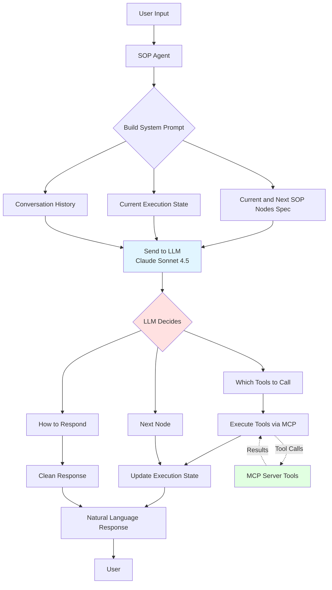
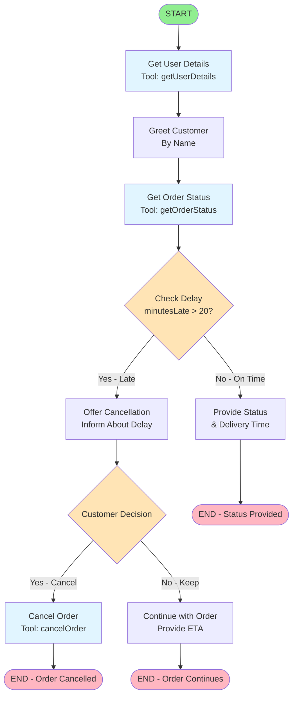

# SOP Engine - LLM Proof of Concept

A proof of concept demonstrating Claude's ability to execute Standard Operating Procedures (SOPs) using simple agents with tool calling, without complex orchestration frameworks like LangGraph.

> **Note**: This project has been tested with both **Claude Sonnet 4.5** and **Claude Haiku 4.5**, demonstrating that the LLM-driven architecture works effectively across different model tiers.

## Overview

This project showcases how modern LLMs can navigate workflow decision trees autonomously by:

- Receiving SOPs as unidirectional decision trees
- Tracking execution flow with node progress
- Using MCP (Model Context Protocol) tools for effective execution
- Maintaining natural conversation flow

## Architecture

### LLM-Driven Approach

This POC uses an **LLM-driven architecture** where Claude Sonnet 4.5 receives an optimized SOP definition (only current and next nodes) and execution state on every interaction, and makes all navigation and tool-calling decisions autonomously.

**Token Optimization**: Instead of sending the entire SOP, we send only relevant nodes, achieving **~33% token reduction** while maintaining full functionality.



### Key Innovation

**No hardcoded workflow navigation** - The LLM interprets the SOP structure and makes all decisions. This proves that modern LLMs can execute complex workflows when given:

- Clear SOP structure (JSON decision tree)
- Current execution state
- Available tools
- Natural language instructions

## Prerequisites

- Node.js >= 18
- npm or yarn
- LiteLLM proxy (or direct access to Claude API)
- API key for Claude (tested with Sonnet 4.5 and Haiku 4.5)

## Installation

1. Clone the repository

```bash
git clone <repository-url>
cd sop-engine-llm-poc
```

2. Install dependencies

```bash
npm install
```

3. Configure environment variables

```bash
cp .env.example .env
```

Edit `.env`:

```env
# LiteLLM Configuration
LITELLM_PROXY_URL=http://localhost:4000
MODEL_NAME=claude-sonnet-4.5  # or claude-haiku-4.5

# Or use direct Anthropic API
OPENAI_API_KEY=your-anthropic-api-key-here
```

4. Build the project

```bash
npm run build
```

## Available NPM Commands

```bash
# Development mode (build + run)
npm run dev
```

See `package.json/scripts` for more commands.

## Running the Demo

### Direct API Access

Update your `.env` with your Anthropic API key and run:

```bash
npm run dev
```

## Usage Examples

Once the demo starts, try these example scenarios:

### Scenario 1: Late Order (Cancellation Flow)

```
👤 You: Hi, where is my order #12345?
🤖 Agent: I see your order #12345 is running 25 minutes late...
         Would you like to cancel this order?
👤 You: Yes, please cancel it
🤖 Agent: Your order has been cancelled and a refund of $42.50...
```

### Scenario 2: On-Time Order

```
👤 You: Check status of order #67890
🤖 Agent: Your order #67890 is currently in transit...
         Expected delivery: 5 minutes from now.
```

### Scenario 3: Order Being Prepared

```
👤 You: What's the status of #11111?
🤖 Agent: Your order #11111 is currently being prepared...
```

## SOP Decision Tree

The Order Delay SOP follows this flow:



## Key Features

### 1. Simple Agent Architecture

No complex workflow engines - just clean TypeScript classes:

- `ExecutionStateManager`: Tracks context and progress
- `SOPAgent`: Orchestrates LLM and tool execution with advanced features:
  - Auto-navigation through simple action nodes
  - Response cleaning (removes LLM thinking traces)
  - Fallback mechanisms for error recovery
  - End node detection for graceful conversation closure

### 2. MCP Tool Integration

Tools are exposed via Model Context Protocol:

- `getOrderStatus`: Retrieves order information
- `cancelOrder`: Cancels an order
- `refundOrder`: Processes refunds

### 3. Context-Aware Execution

- Placeholder replacement: `{context.orderId}` → actual order ID
- Condition evaluation: `context.minutesLate > 20`
- Conversation history tracking
- Intelligent context extraction from user messages

### 4. Natural Language Understanding

- LLM interprets user intent for decision nodes without rigid pattern matching
- **Multi-language support**: Automatically responds in the user's language
- **Clean responses**: Removes internal thinking traces and metadata
- Natural conversation flow with graceful endings

### 5. Token Optimization

- **45% reduction in nodes** sent per request (only current + next nodes)
- **~33% reduction in system prompt tokens** (from ~3000+ to ~2008 tokens)
- **Filtered context**: Only sends referenced context keys
- **Scalable**: Handles larger SOPs without token limit issues
- **Cost effective**: Proportional reduction in API costs

### 6. Robust Error Handling

- **Fallback mechanisms** for empty responses
- **Flow reconnection** after tool execution
- **Auto-navigation** through simple nodes
- **Graceful degradation** when errors occur

## Development

### Build

```bash
npm run build
```

### Clean

```bash
npm run clean
```

### Type Checking

```bash
npx tsc --noEmit
```

## Extending the SOP

To create your own SOP:

1. Define the SOP structure in `src/sops/`:

```typescript
export const mySOP: SOP = {
  name: 'My Custom SOP',
  description: 'Description here',
  version: '1.0.0',
  startNode: 'start',
  nodes: {
    start: {
      id: 'start',
      type: 'action',
      messageTemplate: 'Welcome!',
      nextNodes: ['next_step'],
    },
    // ... more nodes
  },
}
```

2. Add tools to the MCP server in `src/mcp-server/index.ts`

3. Update `src/index.ts` to use your SOP

## Testing

The project includes three test orders in the MCP server:

- `12345`: Late order (25 minutes) - triggers cancellation flow
- `67890`: On-time order (5 minutes delay)
- `11111`: Order being prepared (no delay)

## Performance Considerations

- **Latency**: Each LLM call adds ~1-3 seconds
- **Token Usage**: Optimized - ~33% reduction through selective node sending
- **Scalability**: Stateless design allows horizontal scaling
- **Cost**: Low token consumption per conversation (~2008 tokens per request vs ~3000+)
- **Token Efficiency**: Only current and next nodes sent, not entire SOP

## Limitations

### Current Implementation

- **Condition Evaluation**: Uses Function constructor for safe evaluation (better than eval, but still limited)
- **Node Navigation**: Heuristic-based with safety limits (max iterations to prevent infinite loops)
- **Session Management**: Single conversation session (no multi-user support)
- **Intent Detection**: Pattern-based extraction (works for simple cases, could be more sophisticated)
- **Response Cleaning**: Regex-based removal of thinking traces (comprehensive but could miss edge cases)
- **Token Optimization**: Currently optimizes nodes and context; conversation history could be further optimized

## Future Enhancements

### Enhanced Features

- [ ] Session management for multi-user concurrent conversations
- [ ] Proper expression evaluator for complex conditions
- [ ] State persistence (database integration)
- [ ] Rollback capabilities for error recovery
- [ ] Comprehensive logging and monitoring
- [ ] Metrics collection (response times, success rates)

### Robustness Improvements

- [ ] Explicit node transition instructions from LLM
- [ ] Timeout handling for long-running tool executions
- [ ] Rate limiting and quota management

### Scalability

- [ ] Caching layer for SOP definitions
- [ ] Async processing for tool execution
- [ ] Load balancing for MCP servers
- [ ] Connection pooling for database and external services

### Security

- [ ] Input validation and sanitization
- [ ] Secure credential management for MCP tools
- [ ] Audit logging for compliance
- [ ] Rate limiting to prevent abuse

### Additional Features

- [ ] SOP visualization UI
- [ ] A/B testing framework for different SOP versions
- [ ] Integration with real customer support systems
- [ ] Conversation history optimization for token efficiency

## Conclusion

This proof of concept demonstrates that **modern LLMs can execute complex workflows autonomously** when provided with:

1. Clear SOP structure (JSON)
2. Current execution state (optimized for tokens)
3. Available tools
4. Natural language instructions

No traditional workflow orchestration framework needed. **The LLM IS the orchestrator.**

### Key Achievements

✅ **Fully autonomous workflow navigation**
✅ **Natural multi-language conversations**
✅ **Clean, user-focused responses**
✅ **Robust error handling with fallbacks**
✅ **Intelligent context extraction**
✅ **Graceful conversation endings**
✅ **Token-efficient prompts (33% reduction)**
✅ **Scalable to larger SOPs**

### What This Enables

- Simpler workflow automation
- More flexible business logic
- Easier maintenance and updates
- Natural conversation experiences
- Multi-language customer support without translation layers
- Self-healing conversations that recover from errors
- **Cost-effective LLM operations at scale**
- **Handling complex SOPs without token limits**

The future of workflow automation may not need complex frameworks—just good prompts, capable LLMs, and thoughtful implementation of core patterns like response cleaning, auto-navigation, fallback handling, and **token optimization**.

For detailed architecture information, see [`ARCHITECTURE.md`](ARCHITECTURE.md).

## License

ISC

## Contributing

Contributions are welcome! Please feel free to submit a Pull Request.

## Support

For questions or issues, please open an issue on the repository.
