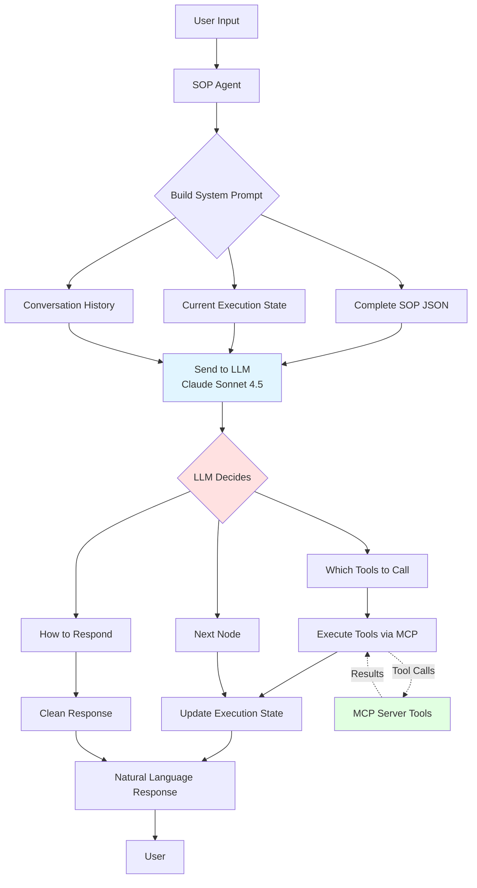

# SOP Engine - LLM Proof of Concept

A proof of concept demonstrating Claude Sonnet 4.5's ability to execute Standard Operating Procedures (SOPs) using simple agents with tool calling, without complex orchestration frameworks like LangGraph.

## Overview

This project showcases how modern LLMs can navigate workflow decision trees autonomously by:

- Receiving SOPs as unidirectional decision trees
- Tracking execution flow with node progress
- Using MCP (Model Context Protocol) tools for effective execution
- Maintaining natural conversation flow

## Architecture

### LLM-Driven Approach

This POC uses an **LLM-driven architecture** where Claude Sonnet 4.5 receives the complete SOP definition and execution state on every interaction, and makes all navigation and tool-calling decisions autonomously.



### Key Innovation

**No hardcoded workflow navigation** - The LLM interprets the SOP structure and makes all decisions. This proves that modern LLMs can execute complex workflows when given:

- Clear SOP structure (JSON decision tree)
- Current execution state
- Available tools
- Natural language instructions

## Prerequisites

- Node.js >= 18
- npm or yarn
- LiteLLM proxy (or direct access to Claude API)
- API key for Claude Sonnet 4.5

## Installation

1. Clone the repository

```bash
git clone <repository-url>
cd sop-engine-llm-poc
```

2. Install dependencies

```bash
npm install
```

3. Configure environment variables

```bash
cp .env.example .env
```

Edit `.env`:

```env
# LiteLLM Configuration
LITELLM_PROXY_URL=http://localhost:4000
MODEL_NAME=claude-sonnet-4.5

# Or use direct Anthropic API
OPENAI_API_KEY=your-anthropic-api-key-here
```

4. Build the project

```bash
npm run build
```

## Available NPM Commands

```bash
# Development mode (build + run)
npm run dev
```

See `package.json/scripts` for more commands.

## Running the Demo

### Option 1: With LiteLLM Proxy (Recommended)

1. Start LiteLLM proxy in a separate terminal:

```bash
litellm --model anthropic/claude-sonnet-4.5
```

2. Run the interactive demo:

```bash
npm run demo
```

### Option 2: Direct API Access

Update your `.env` with your Anthropic API key and run:

```bash
npm run dev
```

## Usage Examples

Once the demo starts, try these example scenarios:

### Scenario 1: Late Order (Cancellation Flow)

```
👤 You: Hi, where is my order #12345?
🤖 Agent: I see your order #12345 is running 25 minutes late...
         Would you like to cancel this order?
👤 You: Yes, please cancel it
🤖 Agent: Your order has been cancelled and a refund of $42.50...
```

### Scenario 2: On-Time Order

```
👤 You: Check status of order #67890
🤖 Agent: Your order #67890 is currently in transit...
         Expected delivery: 5 minutes from now.
```

### Scenario 3: Order Being Prepared

```
👤 You: What's the status of #11111?
🤖 Agent: Your order #11111 is currently being prepared...
```

## SOP Decision Tree

The Order Delay SOP follows this flow:


## Key Features

### 1. Simple Agent Architecture

No complex workflow engines - just clean TypeScript classes:

- `ExecutionStateManager`: Tracks context and progress
- `SOPNavigator`: Handles decision tree navigation
- `SOPAgent`: Orchestrates LLM and tool execution

### 2. MCP Tool Integration

Tools are exposed via Model Context Protocol:

- `getOrderStatus`: Retrieves order information
- `cancelOrder`: Cancels an order
- `refundOrder`: Processes refunds

### 3. Context-Aware Execution

- Placeholder replacement: `{context.orderId}` → actual order ID
- Condition evaluation: `context.minutesLate > 20`
- Conversation history tracking

### 4. Natural Language Understanding

LLM interprets user intent for decision nodes without rigid pattern matching.

## Development

### Build

```bash
npm run build
```

### Clean

```bash
npm run clean
```

### Type Checking

```bash
npx tsc --noEmit
```

## Extending the SOP

To create your own SOP:

1. Define the SOP structure in `src/sops/`:

```typescript
export const mySOP: SOP = {
  name: 'My Custom SOP',
  description: 'Description here',
  version: '1.0.0',
  startNode: 'start',
  nodes: {
    start: {
      id: 'start',
      type: 'action',
      messageTemplate: 'Welcome!',
      nextNodes: ['next_step'],
    },
    // ... more nodes
  },
}
```

2. Add tools to the MCP server in `src/mcp-server/index.ts`

3. Update `src/index.ts` to use your SOP

## Testing

The project includes three test orders in the MCP server:

- `12345`: Late order (25 minutes) - triggers cancellation flow
- `67890`: On-time order (5 minutes delay)
- `11111`: Order being prepared (no delay)

## Performance Considerations

- **Latency**: Each LLM call adds ~1-3 seconds
- **Token Usage**: Minimal - only decision evaluation requires LLM
- **Scalability**: Stateless design allows horizontal scaling
- **Cost**: Low token consumption per conversation

## Limitations

- Simple condition evaluation (production should use proper expression parser)
- Mock data in MCP server (replace with real database)
- Basic error handling (enhance for production)
- Single conversation at a time (add session management for multi-user)

## Future Enhancements

- [ ] Advanced condition evaluation with safe expression parser
- [ ] Database integration for real order data
- [ ] Multi-user session management
- [ ] Logging and analytics
- [ ] SOP visualization UI
- [ ] A/B testing framework for different SOP versions
- [ ] Integration with real customer support systems

## Conclusion

This proof of concept demonstrates that modern LLMs like Claude Sonnet 4.5 can execute complex workflows without heavy orchestration frameworks. The simple agent architecture is:

✅ **Easy to understand**: Clear separation of concerns  
✅ **Maintainable**: Standard TypeScript patterns  
✅ **Extensible**: Simple to add new SOPs and tools  
✅ **Efficient**: Minimal token usage and latency

## License

ISC

## Contributing

Contributions are welcome! Please feel free to submit a Pull Request.

## Support

For questions or issues, please open an issue on the repository.
